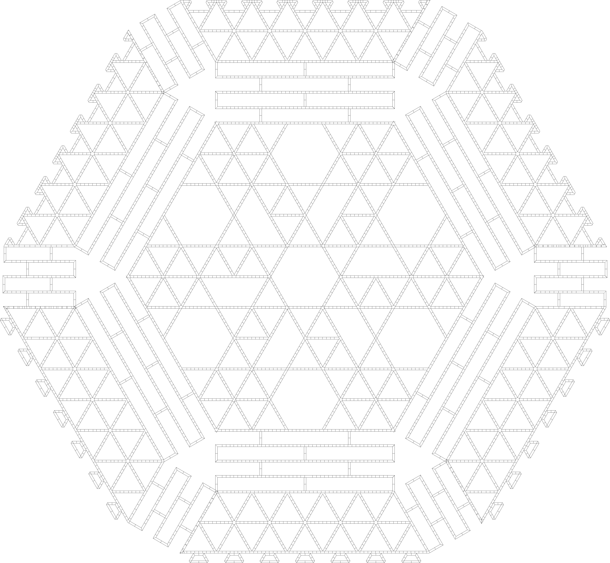

To sequester meaningful amounts of carbon from the athmosphere, we need a positive feedback process not constrained with resources.

Where we can find enough material and energy (area) not to be a constraint?

Oceans.

But to do anything, we need solid surfaces.

So othe plan is to use solid surfaces to grow biomass and food, and generate electricity.

We use the biomass and electricity to produce plastic, which we 3D print to make the platform modules, the wind turbines and mostly everything we need.

We source anything which cannot be made from plastic from the land. We sell seafood and local produce to have money.

If you are interested, drop me an email.

[The process model](raft)

[Structure](structure.html)

