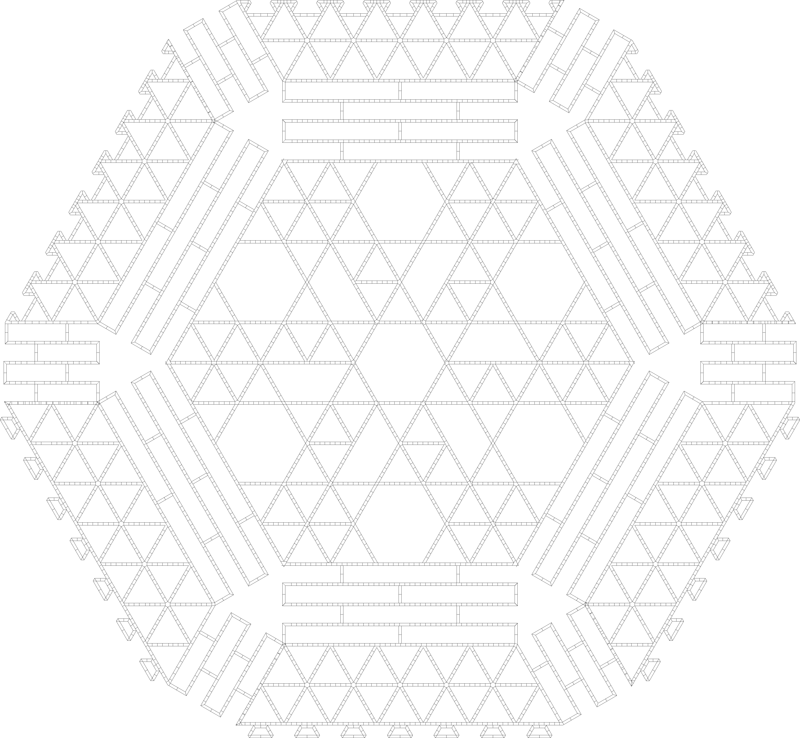
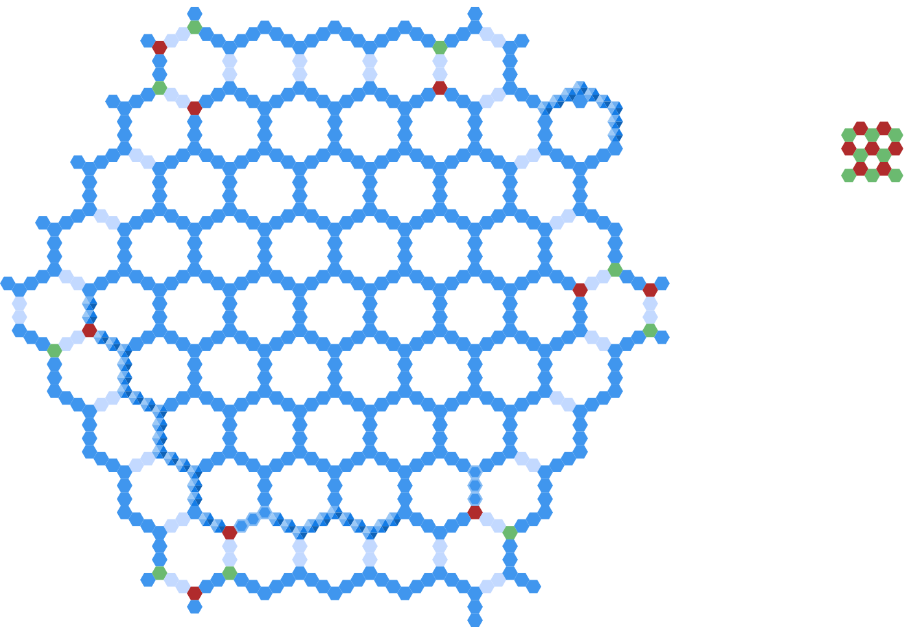

All of the technical details here are subject to change as the design is explored in detail.

One of the gratest challenges of any deepwater structure is to cope with waves.

Currently working and proposed solutions try to solve this by using vertical space (like typical oil platforms), or big barrier structures (seawalls).

Those structures are inherently invest material (hence money) into masses with the sole purpose of fighting wave energy, unusable for other purposes.

The Raft solves this problem by not trying to fight wave energy in a dedicated point.
Some 4/5 of a tile (our building block) is underwater, and each tile is supported by the neighbouring tiles.
This means that big waves just submerge the tiles, while a tile need to dissipate only a small amount of the energy of the wave.
To be able to do that, the internal structure of the tiles have deformation zones, where they essentially convert the energy to vertical movement of water.

This means that large areas of the perimeter are not suitable for human habitat as waves of storms just go through them mostly unimpeded.
However those areas are still suitable for fish and kelp farming, as they will not be concerned with waves above them. So the perimeter areas will be "fish biome".
These areas will experience relatively large forces on each tile. The overall force on the structure can be minimized by submersing the tiles deeper,
and placing fewer of them in a given area.

Areas a bit further from the perimeter will still occasionally experience submersion, but there are plants which can strive in saltwater.
A well-known such species is mangrove, but there is cordgrass and even babassu, a type of palm tree.
Cordgrass is especially important here. It is a good source of lignocellulose, the input material of PEF production.
So we can call these areas cordgrass biome.

The fish and cordgrass biomes can dissipate wave action to the extent that areas further inside can be suitable for humans, land plants/animals, and industry.

The goal of the platform is not just to provide solid surface for the above activities; it have to support the energy needs as well.
The "easiest" way to do it is using small wind turbines: they are low-tech compared to solar, and there is considerable know-how around it.
Harvesting wave energy is an option for the fish and cordgrass biomes, with the additional advantage of more control over wave energy dissipation.
While wave energy is an area which definitely merits use, and we expect it to be used, we will view it as an optional area for later optimization for two reasons.
First, it is only relevant for fish and cordgrass biomes, so it will not scale with the overall structure itself.
Second, it is not as well researched as wind, and we have to keep focus as we are already dealing with a complex project.

The above considerations drive the design parameters for both the tiles themselves, and the macrostructure.

The tiles should be designed in a way such that their submersion is controllable, and they are able to dissipate forces arising from wave and current action.
On the macrostructure, the goal is to avoid accumulation of such forces which cannot be withstood by the tiles.

A related question is how to make sure that the structure is held in its place. For that there are two major possible approaches.
One is active stationkeeping, where the structure propels itself through water. Some of the oil platforms do exactly this.
Unfortunately due to the level of submersion this is not viable from the energetical standpoint.
So we are left with anchoring. There are several bluewater areas where the depth is relatively small.
Those are near islands - some of them are just submersing due to climate change - and seamounts.
Oil industry have already developed the tools and techniques to work in hundreds of meters of depth, and I expect that with experience we can further hone them.

In terms of macrostructure the challenge is to spread the forces between anchor points and anchored tiles.
This calls for an approach of anchoring many of the tiles, and control the forces on the anchor ropes in a coordinated way.

An approach which seems feasible is to drill holes in the seabed, embed the anchoring devices in them, use huge ropes to drive the forces near the surface, and distribute the force from that point to many tiles.
A way to minimize the force on anchor points is to balance the buoyancy of the ropes. The ropes are expected to be manufactured from UHMWPE or PEF, both of which have density lower than seawater.
This can be counterbalanced with pockets of salt embedded in plastic to get the right buoyancy. Of course this area - as many others - need further analysis to see what can work.

The idea of how a tile would look like from the top is the following:

The edges have notches to lock the tiles together. Between the edges and the center area there is a deformation zone. In the center zone there are 7 vertical hexagonal areas as vertical interfaces:
we can use them to fix structures on top or bottom of the tile, and to get to the bottom from the top. The walls are of double layer cell structure, to provide the minimally needed buoyancy.
The other cells between the double walls can - depending on the application - partly or fully closed, and filled with air, seawater, and provide place for roots of vegetation.
Each cell contains a Hexabitz (or similar) control hardware. The control hardware is responsible to provide island-local control network for control elements of the planted hardware (e.g. wind turbine or anchor gear),
gather measurements from the built-in water level sensor and force sensors in the deformation zone, and drive the pump responsible for maintaining the needed submersion level (if we find that such a pump is needed).
The tiles have channels dedicated for two grids: the local grid is 12V DC, and the power grid is high voltage AC, with DC bridges between island to simplify phase management, and allow for variable voltage operation
based on the balance of supply and demand.

The size of a tile is 3m in side, that is 5.2m between two paralell sides.

Beyond the "normal" tiles there are specialized ones. A notable structure is the "bridge": it contains two normal tiles at the ends, and two fully submersed ones between them.
Bridges define the waterways between islands.

Tiles are structured into cells. Cells have 4 tiles at sides, and they are 7 tiles across. The side of a cell and the side of an adjacent cell is the same, and sides are always present.
The interior area of a cell is either filled in or not: in case of fish biome it is not.

Cells are grouped to islands. Islands are 7 cells accross and 4 cells on the side. Between the island waterways are created using bridges. The traffic is one-way in each of the waterways. 
(red and green tiles denote the tiles which hold the corresponding lights. Red is "left" and green is "right".
There are green, red, and mixed islands (see left side of the above picture, depicting how these islands are located).
Green islands are always taken from right, red islands from the left.
All channels are in the edge of at least one red or green island.
This provides an easy to navigate network of waterways.

